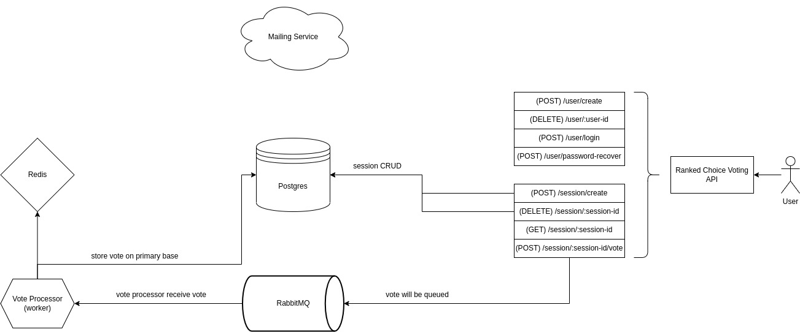

# Ranked Choice Voting (WIP)
API to manage, create and vote by [ranked choice voting system](https://en.wikipedia.org/wiki/Ranked_voting).

## System Design

## Building application
The application was write under Docker infrastructure so you can run `docker compose -f docker/docker-compose.yml build` inside root directory.

## Running application
To startup application and dependent services use `docker compose -f docker/docker-compose.yml up -d` inside root directory.

## Monitoring application
To get application logs run `docker compose -f docker/docker-compose.yml logs -f` inside root directory.
